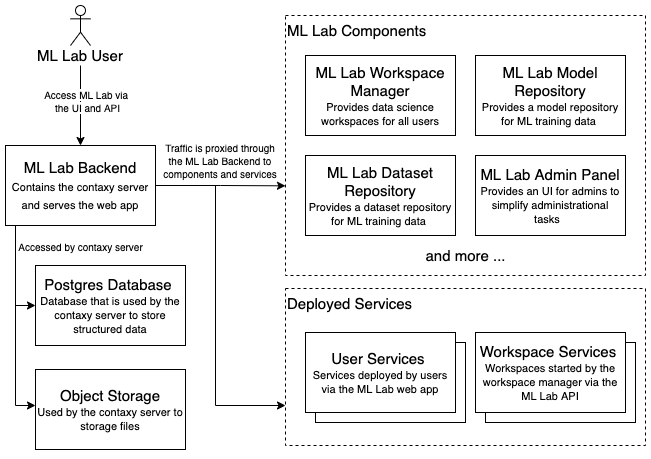

<h1 align="center">
    <a href="https://github.com/sap/machine-learning-lab" title="ML Lab Home">
     </a>
</h1>

<p align="center">
    <strong>End-to-end collaborative development platform to build and run machine learning solutions.</strong>
</p>

<p align="center">
    <a href="https://github.com/sap/machine-learning-lab/commits/" title="Last Commit"></a>
    <a href="https://github.com/sap/machine-learning-lab/blob/master/LICENSE" title="ML Lab License"></a>
    <a href="https://api.reuse.software/info/github.com/sap/machine-learning-lab" title="REUSE status"></a>
</p>

<p align="center">
  <a href="#getting-started">Architecture</a> •
  <a href="#getting-started">Getting Started</a> •
  <a href="#development">Development</a> •
</p>

ML Lab is a centralized hub for development teams to seamlessly build, deploy, and operate machine learning solutions at scale. It is designed to cover the end-to-end machine learning lifecycle from data processing and experimentation to model training and deployment. It combines the libraries, languages, and tools data scientists love, with the infrastructure, services and workflows they need to deliver machine learning solutions into production.

## Highlights

- 🔐 Secure multi-user development plaform for machine learning solutions.
- 🛠 Workspace with integrated tooling (Jupyter, VS Code, SSH, VNC, Hardware Monitoring, ...)
- 🗃️ Upload, manage, version, and share datasets & models.
- 🎛 Deploy and operate machine learning solutions for productive usage.
- 🐳 Deployable on a single-server via Docker or a server-cluster via Kubernetes.

## Architecture
Machine Learning Lab (ML Lab) builds on the [contaxy](https://github.com/ml-tooling/contaxy) server which provides a generic API for managing users and projects, storing files, deploying services and database access.
Using the extension mechanism of contaxy, ML Lab builds machine learning specific functionality on top.
These extensions are called ML Lab components and each have their own backend, frontend and docker image.
The ML Lab backend image leverages the contaxy library to combine all ML Lab components and adds a React frontend application.
The different parts of an ML Lab installation are shown in this diagram:



## Getting Started

### Local Docker Installation

Currently, the ML Lab docker images are not pushed to a registry, so the project has to be build locally.
```
# Install build requirements (use of conda is optional)
conda create --name mllab-build python=3.9
conda activate mllab-build
pip install -r build_requirements.txt

# Build ML Lab components, webapp and docker image
python build.py --make
```
After the build finished, ML Lab can be started using docker compose.
It will start the ML Lab backend, the Postgres and Minio Databases and the ML Lab Components (Workspace Manager, etc.)
```
cd deployment/mllab-docker
docker-compose up
# Visit http://localhost:30010/ and login with username and password "admin"
```
**Important**: The configurations in the docker-compose.yaml are not meant to be used for production
as the JWT secret is the default one and the ports of all services are published, instead of only the core service.
For a list of all configurable environment variables, have a look at the [contaxy config file](./contaxy/backend/src/contaxy/config.py#L31).
All fields of the `Settings` class represent an environment variable that can be set.

### Kubernetes Installation

Similarly to the docker local installation, the ML Lab docker images need to be build locally and pushed to a registry that is accessible by the Kubernetes cluster.
Then the [helm chart](./deployment/mllab-kubernetes) can be used for the installation by adjusting the [values.yaml](./deployment/mllab-kubernetes/values.yaml) file.


## Development

### The build pipeline
Each folder in this repository that contains a buildable part of ML Lab contains a build.py Python script.
This script allows to lint (--check), build (--make) and test (--test) the contents of that folder: 
```
python build.py --check --make --test
```
The build.py script int the root folder calls the build.py scripts of all sub folders and thereby builds the entire ML Lab project.
It is possible to exclude specific folders from the build pipeline:
```
python build.py --skip-path webapp --skip-path components/lab-workspace-manager
```

### Developing an ML Lab Component
An ML Lab component is its own separate application with a frontend and backend packaged into a docker image.
It is started alongside the ML Lab Backend container which discovers the component via labels set on the container.
The component can extend the ML Lab API and its UI is integrated in the main ML Lab UI with an iframe.
For an example of such an ML Lab component, refer to the [ML Lab Workspace Manager](./components/lab-workspace-manager). It contains further information on how the extension is structured and how to develop it locally.
If you want to develop a new ML Lab component, you can copy the [template component](./components/template) and follow the instruction in that folder.


### Developing the ML Lab Web Application
The ML Lab web app is build with JavaScript and React. It communicates with the ML Lab backend (via the contaxy API) and provides the overall UI structure of ML Lab. 
The ML Lab components are integrated into this UI via iframes.
During the build process, the web app is compiled into a minified JavaScript bundle and is then later served by the ML Lab backend.
For development, the web app can be started locally and connect to any other local or remote ML Lab instance.
For more information, see the [webapp folder](./webapp).

### Developing Contaxy Core Features
Sometimes it is necessary to add new features to the conaxy library directly instead of building a contaxy extension (ML Lab component).
Detailed information on how to develop contaxy can be found in the [contaxy repository](https://github.com/ml-tooling/contaxy).
To make the development of contaxy features in conjunction with ML Lab development easier, the contaxy repo is included as a git submodule.
Run the following command to download the contaxy source into the [contaxy folder](./contaxy)
```
git submodule update --init
```
To use this local contaxy code in the ML Lab backend image instead of the version [released on PyPi](https://pypi.org/project/contaxy/), uncomment the [Dockerfile](./Dockerfile) lines 42-43.
